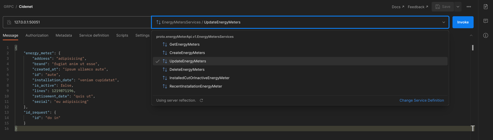

# Prueba de conocimiento - Cidenet

<br />
<p align="center">
  <a href="#">
    
  </a>

<h3 align="center">En esta prueba se observará mis habilidades técnicas en el language de programación en Golang</h3>
</p>

#### Requirements

La prueba a continuación esta dividida en 5 puntos. Cada uno de los puntos tiene un grado de dificultad mayor. Envíe la prueba hasta el punto que haya logrado desarrollar completamente.
En enerBit se presenta el reto de registrar y hacer seguimiento de los medidores de energía que se han instalado en los predios de nuestros clientes. Tenga en cuenta que un medidor puede ser instalado en un predio por un período de tiempo, sin embargo este puede ser retirado e instalado nuevamente en otro.


#### List of commands available

```bash
# Check commands available
make build -- Check all files

make run   -- Start Server

make test  -- Perform coverage tests

make up    -- Docker up

make down  -- Docker down

```

## Environment
```
Se debe sacar copia del archivo .env.example o correr el comando make build
```

## App Development

Este proyecto fue desarrollado GO Y GRPC se deja habilitada la opcion para realizar las pruebas con el postman. 


## Authors

Victor Elias Barrera Florez <vbarrera@outlook.com>